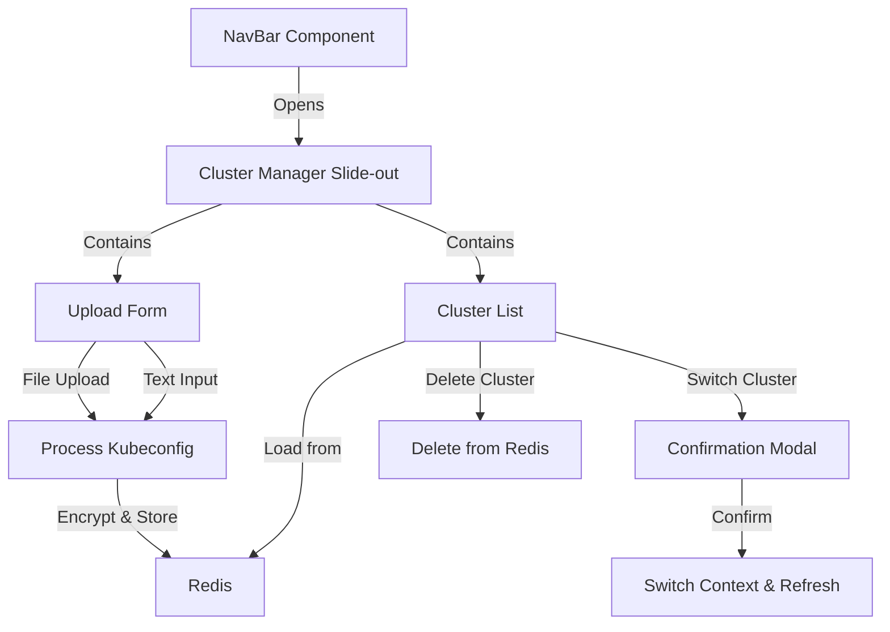
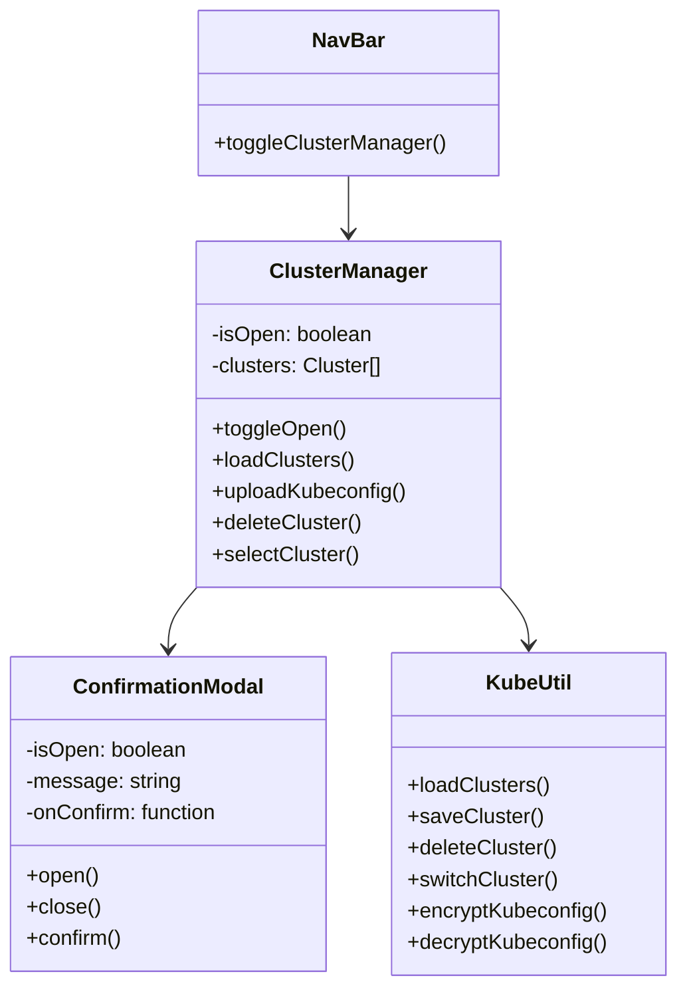
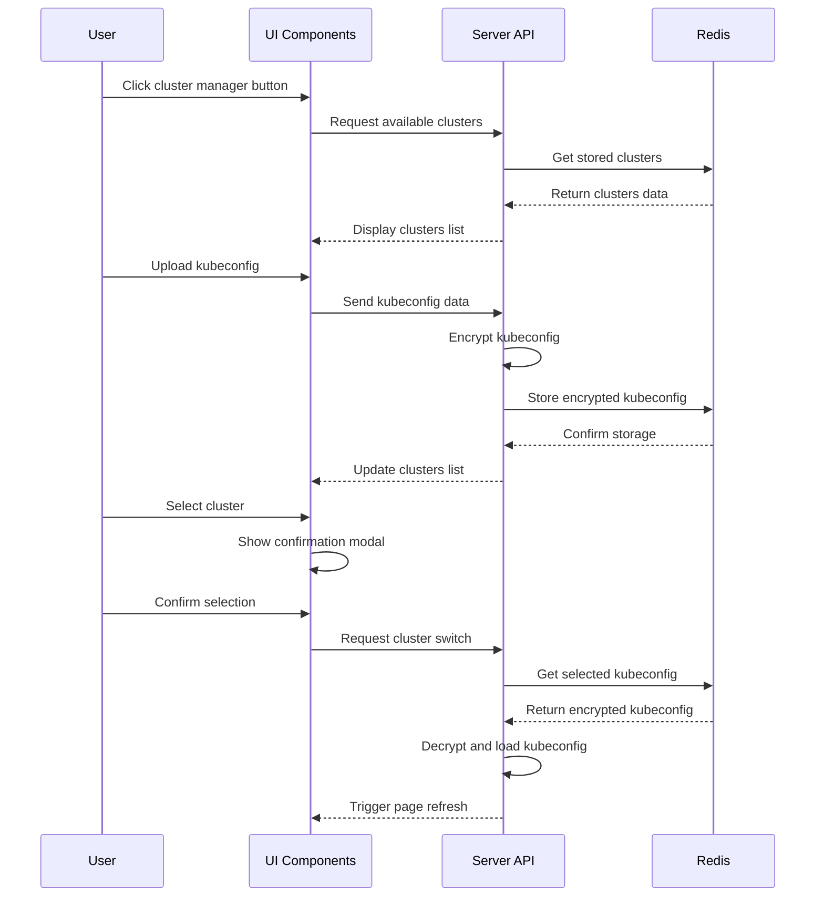

# Kubernetes Cluster Management Feature Implementation Plan

## Overview

We'll implement a slide-out menu that allows users to upload, manage, and switch between multiple Kubernetes cluster configurations. The feature will:

1. Add a button to the NavBar to open the slide-out menu
2. Create a new slide-out menu component for cluster management
3. Allow users to upload kubeconfigs via file upload or text input
4. Store encrypted kubeconfigs in Redis
5. Display a list of available clusters starting with "local"
6. Provide functionality to switch between clusters with confirmation
7. Allow users to delete previously uploaded kubeconfigs

## Architecture

## Component Structure

## Data Flow

## Implementation Steps

### 1. Backend Changes (src/lib/kubeUtil.ts)

1. Add encryption utilities for kubeconfig data
2. Create functions to:
   - Store kubeconfigs in Redis with encryption
   - Retrieve and decrypt kubeconfigs from Redis
   - List available clusters
   - Switch between clusters
   - Delete clusters from Redis

### 2. UI Components

1. Create a new ClusterManager.svelte component
2. Add a button to NavBar.svelte to open the cluster manager
3. Implement the slide-out menu UI with:
   - List of available clusters
   - Upload form (file and text input)
   - Delete buttons for each cluster
   - Confirmation modal for cluster switching

### 3. API Endpoints

1. Create server endpoints to:
   - Upload and store kubeconfigs
   - List available clusters
   - Switch active cluster
   - Delete clusters

### 4. Integration

1. Connect the UI components to the backend functionality
2. Implement page refresh when switching clusters
3. Ensure proper error handling throughout the flow

## Security Considerations

1. **Encryption**: We're encrypting kubeconfigs before storing them in Redis to protect sensitive information.
2. **No Download**: The UI doesn't provide any way to download the stored kubeconfigs.
3. **Access Control**: Since there's no user system yet, anyone with access to the application can manage clusters.
4. **Secure Key Storage**: In a production environment, the encryption key should be stored securely (e.g., in environment variables or a secrets manager).

## Testing Plan

1. **Unit Tests**:

   - Test encryption/decryption functions
   - Test Redis storage and retrieval
   - Test cluster switching logic

2. **Integration Tests**:

   - Test API endpoints
   - Test UI components

3. **Manual Testing**:
   - Upload kubeconfig via file
   - Upload kubeconfig via text input
   - Switch between clusters
   - Delete clusters
   - Verify data is properly loaded after switching clusters

## Deployment Considerations

1. **Environment Variables**:

   - Add `ENCRYPTION_KEY` to environment variables
   - Update Redis connection configuration if needed

2. **Redis Configuration**:

   - Ensure Redis is properly secured
   - Consider enabling persistence for Redis to prevent data loss

3. **Documentation**:
   - Update documentation to include information about the new cluster management feature
