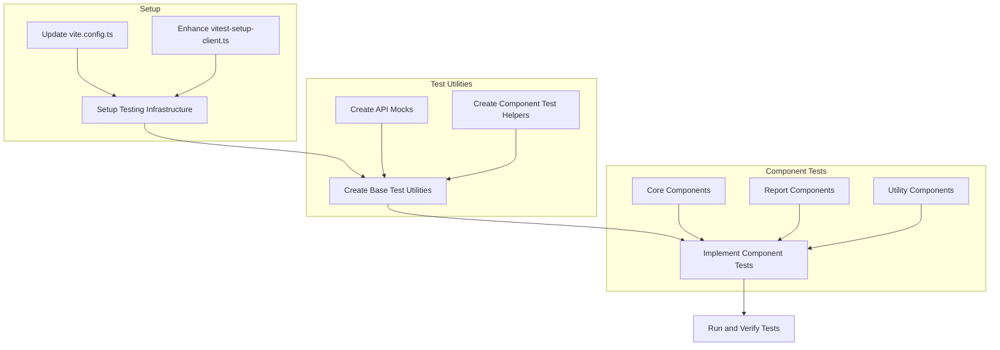

# Test Implementation Plan for Trivy Glass

Based on my analysis of your codebase, I'll create a comprehensive testing strategy focusing on component testing with Vitest. Here's my detailed plan:

## 1. Testing Infrastructure Setup

First, we need to ensure our Vitest configuration is properly set up:

1. Update `vite.config.ts` to include test configuration
2. Enhance the existing `vitest-setup-client.ts` with additional mocks for:
   - Fetch API for testing components that make API calls
   - Redis client and Kubernetes API for testing components that interact with these services
   - LocalStorage for components that use browser storage

## 2. Component Testing Strategy

We'll implement tests for the following key components:

### Core Components
- **NavBar.svelte**: Test navigation functionality and UI elements
- **ClusterManager.svelte**: Test cluster management operations (list, switch, delete)
- **ReportTable.svelte**: Test data display and filtering capabilities

### Report-Related Components
- **Vulnerabilities.svelte**: Test vulnerability data display
- **SecurityChecks.svelte**: Test security check visualization
- **SBOM.svelte**: Test software bill of materials display

### Utility Components
- **ReportHeader.svelte**: Test header rendering with different data
- **DownloadReport.svelte**: Test download functionality

## 3. Testing Approach

For each component, we'll follow this testing pattern:

1. **Rendering Tests**: Verify components render correctly with different props
2. **Interaction Tests**: Test user interactions (clicks, form submissions)
3. **State Management Tests**: Verify state changes correctly
4. **API Integration Tests**: Mock and test API interactions
5. **Error Handling Tests**: Test component behavior with error states

## 4. Mocking Strategy

We'll create the following mocks:

1. **API Mocks**: Mock fetch responses for API endpoints
2. **Kubernetes Utility Mocks**: Mock functions from kubeUtil.ts
3. **UI Library Mocks**: Mock Svelte UI components as needed

## 5. Implementation Plan

Here's how we'll implement the tests:

## 6. Detailed Implementation Steps

1. Update Vite configuration for testing
2. Create test utilities and mocks
3. Implement component tests in order of importance
4. Ensure all tests pass with `npm run test`